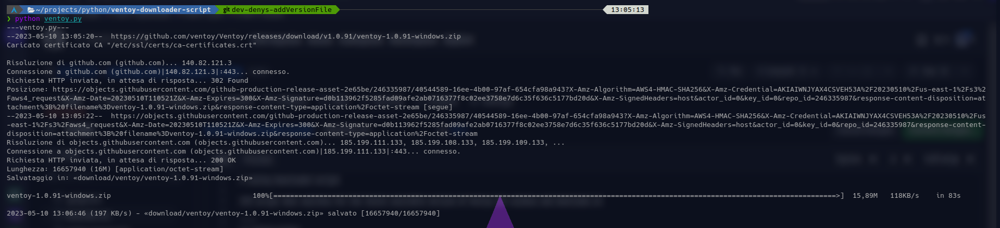

# ventoy-downloader-script

### script that searches for the latest available version of Ventoy for windows and downloads it

## INSTALLATION
---
- first you need to satisfy the program's dependencies
  - to do this you need to have pip installed on your computer and write the following command in the terminal

```pip install -r dependecy/requirements.txt```

- run the script to install the latest version of python
  - if you want you can candelarize the execution of the script according to the use you want to make of it

## EXECUTE
---
- to execute the program open a terminal and write this command:
```
python ventoy.py
```
- that's the output
  

## CONTACT
---
<center>
  <table border=0>
    <tr>
      <td>
        <a href="https://github.com/D3ENNY">
          
        </a>
      </td>
      <td>
        <a href="mailto:denysraimondi06@gmail.com">
          
        </a>
      </td>
        <td>
          <a href="https://t.me/D3ENNY04">
            
          </a>
      </td>
    </tr>
    <tr>
      <td>github</td>
      <td>email</td>
      <td>telegram</td>
    </tr>
  </table>
</center>

## SUPPORT ME
---
If you want support me and my project you can give me a little donation at:
<center>
  <table border=0>
    <tr>
      <td>
        <a href="https://paypal.me/denysraimondi">
          
        </a>
      </td>
      <td>
        <a href="https://www.buymeacoffee.com/D3ENNY">
          
        </a>
      </td>
    </tr>
    <tr>
      <td>paypal</td>
      <td>Buy Me A Coffee</td>
    </tr>
  </table>
</center>